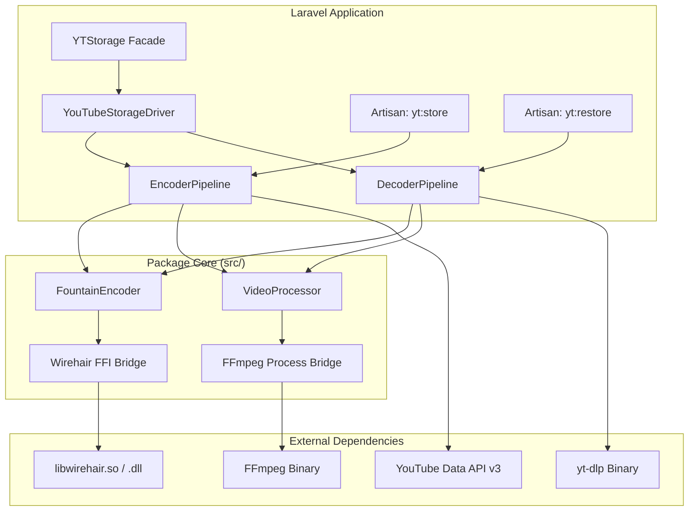
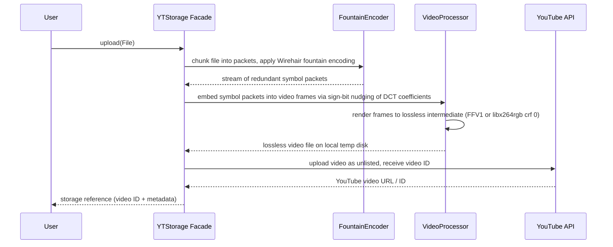
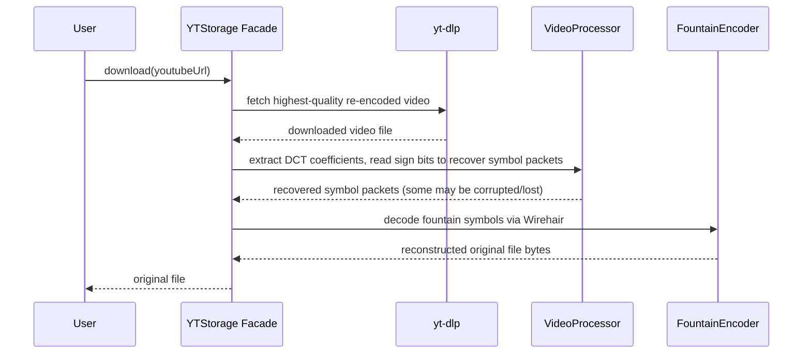
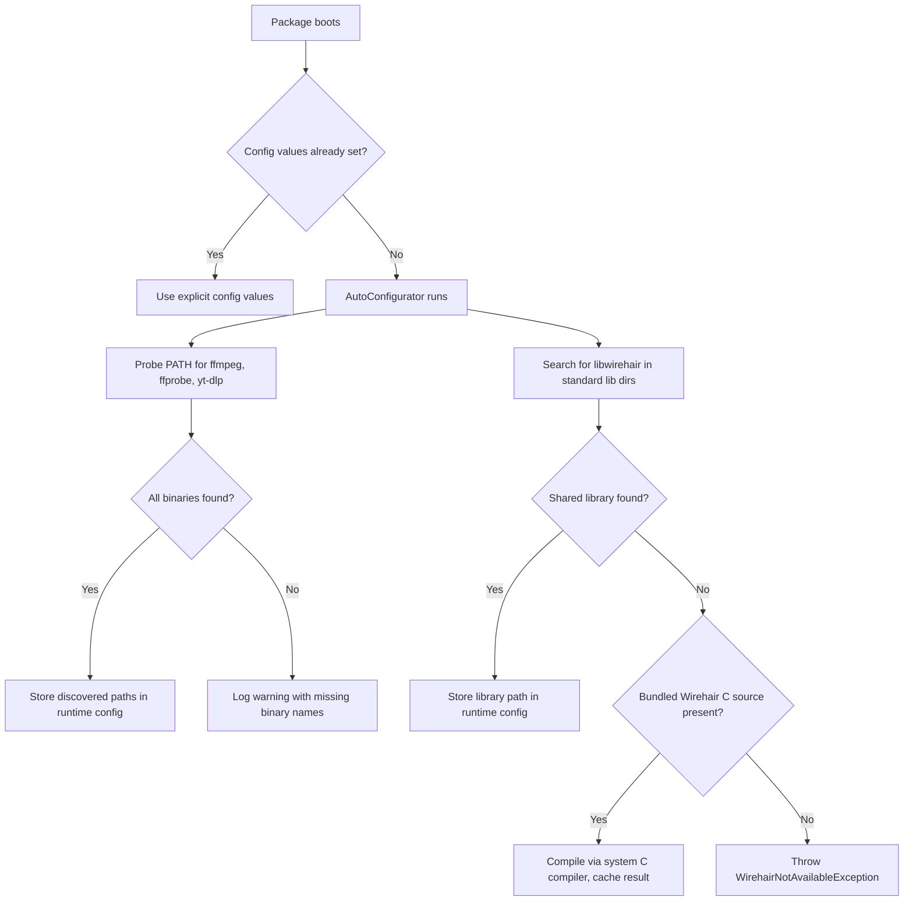
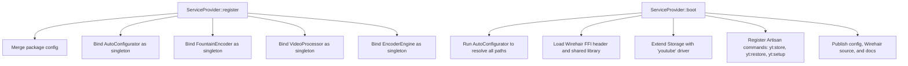

# Design: shamimstack/youtube-cloud-storage

## 1. Overview

A Laravel 12 package that turns YouTube into a file storage backend. Files are encoded into video frames using sign-bit nudging of DCT coefficients (resilient to YouTube's lossy re-encoding), protected by Wirehair fountain codes for O(N) redundancy, and uploaded as unlisted YouTube videos. The package surfaces this as a native Laravel Storage disk, a Facade, and two Artisan commands -- all built on PHP 8.4 language features.

---

## 2. Architecture

### 2.1 Component Map

### 2.2 High-Level Data Flow

**Upload (Encode + Store)**

**Download (Retrieve + Decode)**

---

## 3. Core Algorithm: Sign-Bit Nudging in DCT Domain

### 3.1 Concept

YouTube re-encodes every uploaded video (typically H.264, VP9, or AV1). Standard pixel-level steganography is destroyed in this process. Sign-bit nudging targets the **sign (positive/negative)** of mid-to-low-frequency DCT coefficients, which is the most resilient property through lossy quantization.

### 3.2 Encoding Strategy

| Step | Description |
|------|-------------|
| 1. Frame generation | Generate raw video frames where each frame is a carrier for a fixed number of data bits |
| 2. DCT transform | Apply block-wise 8x8 DCT to each frame (same block structure H.264/VP9 will use internally) |
| 3. Coefficient selection | Select a subset of mid-frequency coefficients per block (e.g., positions (0,1), (1,0), (2,0), (0,2)) that are large enough to survive quantization |
| 4. Sign-bit embedding | For each selected coefficient, set its sign to encode one bit: positive = 0, negative = 1. Ensure the coefficient magnitude exceeds a configurable threshold to survive quantization |
| 5. Inverse DCT | Transform back to pixel domain, producing the carrier frame |
| 6. Lossless export | Encode all frames into a lossless intermediate video using FFV1 (MKV) or libx264rgb with CRF 0, preserving exact pixel values for the initial upload |

### 3.3 Decoding Strategy (Post-YouTube Re-encoding)

| Step | Description |
|------|-------------|
| 1. Download | Retrieve the re-encoded video at highest available quality via yt-dlp |
| 2. Frame extraction | Decode video to raw frames via FFmpeg |
| 3. DCT transform | Apply the same 8x8 block-wise DCT |
| 4. Sign-bit reading | Read the sign of each selected coefficient at the known positions to recover data bits |
| 5. Packet reconstruction | Reassemble bits into fountain-coded symbol packets |
| 6. Fountain decode | Feed packets into Wirehair decoder; recover original file once sufficient symbols are collected |

### 3.4 Resilience Parameters

| Parameter | Purpose | Default |
|-----------|---------|---------|
| Coefficient magnitude threshold | Minimum absolute value a coefficient must have to be a valid carrier; below this the bit is marked as an erasure | 30 |
| Coefficient positions per 8x8 block | Which DCT positions are used for embedding | (0,1), (1,0), (1,1), (2,0) |
| Redundancy factor | Ratio of fountain-coded symbols to original data packets (e.g., 1.5 means 50% overhead) | 1.5 |
| Frame resolution | Resolution of generated carrier video | 1920x1080 |
| Frame rate | FPS of carrier video | 30 |

---

## 4. Fountain Code Layer (Wirehair via FFI)

### 4.1 Purpose

YouTube re-encoding will corrupt or destroy some DCT sign bits. Wirehair fountain codes provide O(N) erasure recovery: as long as roughly N + a small overhead of the encoded symbols are correctly recovered, the full original data is reconstructable.

### 4.2 FFI Bridge Design

The `FountainEncoder` class wraps the Wirehair C library through PHP 8.4 FFI.

**Wirehair C API Functions to Bind**

| C Function | Purpose |
|------------|---------|
| `wirehair_init()` | One-time library initialization |
| `wirehair_encoder_create(nullptr, data, dataBytes, packetSize)` | Create encoder from source data |
| `wirehair_encode(codec, blockId, out, outSize, &writeLen)` | Generate a coded symbol block |
| `wirehair_decoder_create(nullptr, dataBytes, packetSize)` | Create decoder expecting given data size |
| `wirehair_decode(codec, blockId, data, dataLen)` | Feed a received symbol into decoder |
| `wirehair_recover(codec, out, outBytes)` | Recover original data once enough symbols received |
| `wirehair_free(codec)` | Release encoder/decoder memory |

### 4.3 FFI Header Loading

The service provider loads the Wirehair C header definition at boot time. The path to the compiled shared library (`libwirehair.so` / `wirehair.dll`) is resolved from the package config.

### 4.4 Packet Structure

Each fountain-coded symbol packet embedded into video frames carries:

| Field | Size | Description |
|-------|------|-------------|
| Block ID | 4 bytes | Wirehair block identifier |
| Payload | configurable (default 1400 bytes) | Fountain-coded symbol data |
| CRC32 | 4 bytes | Integrity check per packet |

---

## 5. File Structure and Component Responsibilities

| File | Responsibility |
|------|---------------|
| `src/YTStorageServiceProvider.php` | Registers bindings, loads config, boots FFI header for Wirehair, extends `Storage` facade with `youtube` driver, registers Artisan commands |
| `src/Facades/YTStorage.php` | Facade accessor for the main storage manager; exposes `upload(File $file)` and `download(string $youtubeUrl)` |
| `src/Engines/FountainEncoder.php` | PHP 8.4 FFI bridge to Wirehair. Handles encoding source data into fountain symbols and decoding received symbols back to original data |
| `src/Engines/VideoProcessor.php` | Orchestrates FFmpeg for frame generation (DCT sign-bit embedding), lossless video export, and post-download frame extraction + sign-bit reading |
| `src/Engines/EncoderEngine.php` | Coordinates the full encode pipeline (chunking, fountain encoding, video processing, upload). Uses asymmetric visibility for internal state |
| `src/Drivers/YouTubeStorageDriver.php` | Implements `League\Flysystem\FilesystemAdapter` to provide `write`, `read`, `delete`, `fileExists`, etc. via the YouTube backend |
| `src/DTOs/StorageConfig.php` | Configuration DTO using PHP 8.4 property hooks to validate FFmpeg path, yt-dlp path, API credentials, and encoding parameters |
| `src/DTOs/PacketMetadata.php` | DTO representing a fountain symbol packet with block ID, payload, and checksum |
| `src/Support/AutoConfigurator.php` | Zero-config environment detector: auto-discovers FFmpeg, FFprobe, yt-dlp, and libwirehair paths on the host system; compiles Wirehair from bundled source if no pre-built binary is found |
| `src/Support/HealthCheck.php` | Validates all runtime prerequisites (binaries, extensions, API credentials) and reports a structured diagnostic result |
| `src/Console/SetupCommand.php` | `yt:setup` -- interactive guided setup that runs auto-configuration, prompts only for values that cannot be auto-detected (YouTube OAuth), and writes a validated `.env` block |
| `config/youtube-storage.php` | Publishable Laravel config file defining all tunable parameters; defaults are resolved at runtime through `AutoConfigurator` so the package works with zero manual config when binaries are on PATH |
| `composer.json` | Package manifest requiring `php: ^8.4`, `laravel/framework: ^12.0`, `ext-ffi: *` |
| `docs/index.html` | Single-page static HTML documentation site (self-contained, no build step) covering installation, configuration, usage, API reference, algorithm explanation, and troubleshooting |

---

## 6. Auto-Configuration System

### 6.1 Design Goal

The package must be usable with zero manual configuration when external binaries (FFmpeg, FFprobe, yt-dlp) are available on the system PATH and the PHP FFI extension is enabled. Users should only need to provide YouTube OAuth credentials, which cannot be auto-detected.

### 6.2 AutoConfigurator Discovery Sequence

### 6.3 Binary Discovery Strategy

| Platform | Search Method |
|----------|---------------|
| Linux / macOS | Execute `which <binary>` for each required tool; additionally check `/usr/local/bin`, `/usr/bin`, Homebrew prefix (`/opt/homebrew/bin`) |
| Windows | Execute `where <binary>` for each required tool; additionally check common install paths (`C:\ffmpeg\bin`, `C:\Program Files\yt-dlp`) |
| All | If an environment variable is set (e.g., `FFMPEG_PATH`), use it with highest priority before any probing |

### 6.4 Wirehair Auto-Compilation

The package bundles the Wirehair C source under `resources/wirehair/`. When no pre-built shared library is detected, the `AutoConfigurator` attempts to compile it:

| Step | Description |
|------|-------------|
| 1. Detect C compiler | Check for `gcc`, `clang`, or `cl.exe` on PATH |
| 2. Compile to shared lib | Invoke the compiler with appropriate flags to produce `libwirehair.so` (Linux/macOS) or `wirehair.dll` (Windows) |
| 3. Cache result | Store compiled binary in the package's `storage/youtube-storage/lib/` directory |
| 4. Validate | Load via FFI and call `wirehair_init()` to verify the build |

If no compiler is available, the exception message includes platform-specific instructions for installing a pre-built binary.

### 6.5 `yt:setup` Artisan Command

A guided setup command that chains auto-detection with interactive prompts:

| Phase | Behavior |
|-------|----------|
| 1. Environment scan | Runs `AutoConfigurator` and `HealthCheck`, displays a diagnostic table of all dependencies (found/missing) |
| 2. Credential collection | Uses Laravel Prompts to ask for YouTube OAuth Client ID and Client Secret (with `password()` input for the secret) |
| 3. OAuth flow | Opens the browser-based Google OAuth consent screen, captures the refresh token |
| 4. Env writing | Appends the discovered paths and credentials as environment variables to `.env` (with user confirmation) |
| 5. Verification | Runs a full health check and displays pass/fail status per component |

### 6.6 HealthCheck Diagnostic

The `HealthCheck` class produces a structured report used by both the `yt:setup` command and a programmatic API:

| Check | Validation |
|-------|------------|
| PHP version | `>= 8.4.0` |
| FFI extension | `extension_loaded('ffi')` returns true |
| FFmpeg binary | Binary exists and responds to `--version` |
| FFprobe binary | Binary exists and responds to `--version` |
| yt-dlp binary | Binary exists and responds to `--version` |
| Wirehair library | FFI can load the shared library and `wirehair_init()` succeeds |
| YouTube API credentials | OAuth credentials are present; optionally tests token refresh |
| Temp disk writable | Laravel temp disk path is writable |

---

## 7. PHP 8.4 Feature Usage

### 7.1 Property Hooks (DTOs and Config)

The `StorageConfig` DTO uses property hooks for validation. For example, the `ffmpegPath` property has a `set` hook that validates the path exists and is executable before assigning it. Similarly, `redundancyFactor` has a `set` hook that enforces a minimum of 1.0.

### 7.2 Asymmetric Visibility

`EncoderEngine` exposes read-only access to its pipeline state (e.g., current phase, progress percentage, last error) via `public private(set)` properties. External consumers can observe state but only the engine itself can mutate it.

### 7.3 Typed Constants

The `VideoProcessor` and `FountainEncoder` classes define typed constants for:
- DCT coefficient positions (array of tuples)
- Default packet size (int)
- Minimum coefficient magnitude threshold (int)
- Supported video codecs (string)

---

## 8. Laravel Integration

### 8.1 Service Provider Boot Sequence

### 8.2 Storage Driver Registration

The service provider calls `Storage::extend('youtube', ...)` in its `boot` method. This callback instantiates a `Filesystem` wrapping the `YouTubeStorageDriver` adapter. Users then configure a disk in `config/filesystems.php` with `'driver' => 'youtube'`.

### 8.3 Facade Methods

| Method | Signature | Description |
|--------|-----------|-------------|
| `upload` | `upload(File $file): StorageReference` | Encodes file into video, uploads to YouTube, returns a reference containing the video ID and metadata |
| `download` | `download(string $youtubeUrl): File` | Downloads video via yt-dlp, decodes frames, reconstructs original file |

### 8.4 Storage Disk Operations Mapping

| Flysystem Method | YouTube Behavior |
|------------------|-----------------|
| `write($path, $contents)` | Encode contents to video, upload to YouTube, store video ID mapped to `$path` in a local metadata index |
| `read($path)` | Look up video ID from metadata index, download via yt-dlp, decode, return contents |
| `delete($path)` | Delete video via YouTube API, remove from metadata index |
| `fileExists($path)` | Check metadata index for existence of path mapping |
| `listContents($path)` | Return entries from the metadata index under the given prefix |

A local metadata index (JSON or SQLite file) maintains the mapping between logical file paths and YouTube video IDs, along with encoding parameters needed for decoding.

---

## 9. Artisan Commands

### 9.1 `yt:store {path}`

| Aspect | Detail |
|--------|--------|
| Argument | `path` -- local file path to encode and upload |
| Options | `--encrypt` (flag), `--password` (string), `--redundancy` (float), `--codec` (ffv1 or libx264rgb) |
| UX | Uses Laravel Prompts: themed `spin()` during encoding, `progress()` bar for upload, `info()`/`note()` for status, `table()` for final result (video URL, file size, redundancy ratio, elapsed time) |
| Output | Displays the YouTube video URL/ID upon successful upload |

### 9.2 `yt:restore {url}`

| Aspect | Detail |
|--------|--------|
| Argument | `url` -- YouTube video URL to download and decode |
| Options | `--output` (string, output path), `--password` (string for decryption) |
| UX | Uses Laravel Prompts: `spin()` during yt-dlp download, `progress()` bar during frame extraction and decoding, `info()` for integrity verification result |
| Output | Writes the reconstructed file to the specified output path |

---

### 9.3 `yt:setup`

| Aspect | Detail |
|--------|--------|
| Arguments | None |
| Options | `--force` (overwrite existing .env values), `--no-interaction` (skip prompts, rely on auto-detection only) |
| UX | Uses Laravel Prompts: `table()` for dependency status, `text()`/`password()` for credential input, `confirm()` before writing to `.env`, `spin()` during OAuth token exchange |
| Output | Writes environment variables to `.env`, displays final health check table |

---

## 10. Configuration Schema

The publishable config file `config/youtube-storage.php` exposes. All path-type values default to `null`, meaning the `AutoConfigurator` will resolve them at runtime.

| Key | Type | Description |
|-----|------|-------------|
| `ffmpeg_path` | string or null | Absolute path to FFmpeg binary; `null` triggers auto-detection |
| `ffprobe_path` | string or null | Absolute path to FFprobe binary; `null` triggers auto-detection |
| `ytdlp_path` | string or null | Absolute path to yt-dlp binary; `null` triggers auto-detection |
| `wirehair_lib_path` | string or null | Path to compiled Wirehair shared library; `null` triggers auto-detection and auto-compilation |
| `wirehair_header_path` | string or null | Path to Wirehair C header file for FFI; defaults to bundled header |
| `youtube_api_key` | string | YouTube Data API v3 key |
| `youtube_oauth_credentials` | array | OAuth 2.0 client ID/secret for upload capability |
| `default_codec` | string | `ffv1` or `libx264rgb` |
| `packet_size` | int | Fountain code packet size in bytes (default: 1400) |
| `redundancy_factor` | float | Symbol overhead ratio (default: 1.5) |
| `coefficient_threshold` | int | Minimum DCT coefficient magnitude for embedding (default: 30) |
| `dct_positions` | array | List of (row, col) positions within 8x8 blocks used for sign-bit embedding |
| `frame_resolution` | array | Width and height of carrier video frames (default: [1920, 1080]) |
| `frame_rate` | int | FPS of carrier video (default: 30) |
| `temp_disk` | string | Laravel disk name used for temporary intermediate files |
| `metadata_store` | string | Driver for the path-to-videoID index (`json` or `sqlite`) |

---

## 11. External Dependency Requirements

| Dependency | Role | Delivery |
|------------|------|----------|
| FFmpeg (with libx264rgb, FFV1 support) | Video encoding/decoding, DCT operations | System binary, path configured |
| yt-dlp | Downloading re-encoded videos from YouTube | System binary, path configured |
| libwirehair (.so / .dll) | Fountain code encoding/decoding | Compiled C shared library loaded via PHP FFI |
| YouTube Data API v3 | Video upload, deletion, metadata queries | Google API client, OAuth 2.0 credentials |
| PHP FFI extension | Bridging Wirehair C library from PHP | PHP extension, must be enabled |

---

## 12. Composer Manifest Requirements

| Field | Value |
|-------|-------|
| `name` | `shamimstack/youtube-cloud-storage` |
| `require.php` | `^8.4` |
| `require.ext-ffi` | `*` |
| `require.laravel/framework` | `^12.0` |
| `require.google/apiclient` | `^2.0` |
| `autoload.psr-4` | `Shamimstack\\YouTubeCloudStorage\\` mapped to `src/` |
| `extra.laravel.providers` | `Shamimstack\\YouTubeCloudStorage\\YTStorageServiceProvider` |
| `extra.laravel.aliases` | `YTStorage` mapped to `Shamimstack\\YouTubeCloudStorage\\Facades\\YTStorage` |

---

## 13. Error Handling Strategy

| Scenario | Handling |
|----------|---------|
| FFI library not found or load failure | Throw a dedicated `WirehairNotAvailableException` at service provider boot with instructions for installing the library |
| FFmpeg / yt-dlp binary not found | `StorageConfig` property hook throws `BinaryNotFoundException` during config validation |
| YouTube API upload failure | Retry up to 3 times with exponential backoff; throw `UploadFailedException` with API error details |
| Insufficient fountain symbols recovered | Throw `InsufficientRedundancyException` with count of recovered vs. required symbols |
| DCT coefficient threshold yields zero usable coefficients | Throw `EncodingParameterException` advising to lower threshold or change DCT positions |
| File exceeds maximum encodable size (based on frame count limits) | Validate before encoding; throw `FileTooLargeException` with computed maximum size |

---

## 14. Capacity Model

The theoretical data capacity per video depends on:

| Factor | Formula Component |
|--------|-------------------|
| Bits per frame | `(frame_width / 8) * (frame_height / 8) * positions_per_block` |
| Raw bytes per frame | `bits_per_frame / 8` |
| Effective bytes per frame | `raw_bytes_per_frame / redundancy_factor` |
| Effective bytes per second | `effective_bytes_per_frame * frame_rate` |
| Max file size for N-minute video | `effective_bytes_per_second * 60 * N` |

For default settings (1920x1080, 4 positions per block, 30fps, 1.5x redundancy): approximately 8,640 blocks per frame, yielding roughly 4,320 raw payload bytes per frame, 2,880 effective bytes per frame, and about 86.4 KB/s effective throughput. A 15-minute YouTube video could store approximately 77 MB of original data.

---

## 15. Documentation Site (`docs/index.html`)

### 15.1 Design Approach

A single self-contained HTML file with no external build tools, bundlers, or CDN dependencies. All CSS and JavaScript are inlined. The file is deployable as-is to GitHub Pages, Netlify, or any static host.

### 15.2 Visual Style

Dark theme with cyan/neon accent colors consistent with the "cyberpunk" aesthetic of the Artisan command UI. Monospace headings, smooth-scroll navigation, and syntax-highlighted usage examples (using an inlined minimal highlight library).

### 15.3 Content Sections

| Section | Content |
|---------|---------|
| Hero / Header | Package name, tagline ("YouTube as infinite cloud storage"), version badge, install command |
| Quick Start | Three-step guide: install via Composer, run `yt:setup`, use `Storage::disk('youtube')->put(...)` |
| How It Works | Visual explanation of the encode/upload/download/decode pipeline with embedded SVG diagrams |
| Configuration Reference | Full table of all config keys, types, defaults, and descriptions |
| Facade API | Method signatures and usage examples for `YTStorage::upload()` and `YTStorage::download()` |
| Storage Driver | Explains the Flysystem integration and how to configure the `youtube` disk |
| Artisan Commands | Usage, arguments, options, and example terminal output for `yt:store`, `yt:restore`, and `yt:setup` |
| Algorithm Deep Dive | Explanation of sign-bit nudging, DCT coefficient selection, and fountain code redundancy with illustrative diagrams |
| Troubleshooting | Common errors, their causes, and resolution steps |
| Requirements | PHP version, extensions, system binaries, and YouTube API credential setup guide |
| License | License text and attribution |

### 15.4 Navigation

Fixed sidebar (desktop) or collapsible hamburger menu (mobile) with anchor links to each section. Active section is highlighted as the user scrolls.

### 15.5 Publishable Asset

The service provider registers the `docs/` directory as a publishable asset group:
- Tag: `youtube-storage-docs`
- Publish target: `public/vendor/youtube-storage/`
- This allows users to optionally serve the docs from their own application
