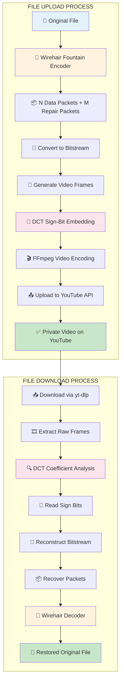

# YouTube Cloud Storage - Workflow Diagram

## Complete Implementation Process Visualization



---

## Detailed Technical Flow

### Phase 1: Encoding (File → YouTube Video)

#### Step 1: Wirehair Fountain Encoding
```
┌─────────────────┐
│  Original File  │  Size: S bytes
│  (PDF, ZIP, etc)│
└────────┬────────┘
         │
         ▼
┌─────────────────────────────────────┐
│   Wirehair Fountain Encoder         │
│                                     │
│  Input:  File data (S bytes)        │
│  Output: N systematic packets       │
│          M repair packets           │
│                                     │
│  Redundancy Factor: 1.5x default    │
│  Recovery: Any N + 2% packets       │
└────────┬────────────────────────────┘
         │
         ├─→ Packet 1: [Header][Data Chunk 1][CRC32]
         ├─→ Packet 2: [Header][Data Chunk 2][CRC32]
         ├─→ ...
         ├─→ Packet N: [Header][Data Chunk N][CRC32]
         └─→ Packet N+1: [XOR Combination][CRC32]
```

#### Step 2: DCT Sign-Bit Embedding
```
Packets → Bitstream Conversion
┌──────────────────────────────────────┐
│  Packet Bits                         │
│  0 1 1 0 1 0 0 1 ...                 │
└────────┬─────────────────────────────┘
         │
         ▼
┌──────────────────────────────────────┐
│  Frame Generator                     │
│                                      │
│  For each bit:                       │
│    - Select DCT coefficient position │
│    - Check magnitude > threshold     │
│    - Adjust sign based on bit value  │
│                                      │
│  Bit 0 → Make coefficient positive   │
│  Bit 1 → Make coefficient negative   │
└────────┬─────────────────────────────┘
         │
         ▼
┌──────────────────────────────────────┐
│  8×8 DCT Block                       │
│  ┌────┬────┬────┬────┬────┬────┐    │
│  │ DC │ AC │ AC │ AC │ AC │ .. │    │
│  ├────┼────┼────┼────┼────┼────┤    │
│  │ AC │ AC │ *  │ *  │ AC │ .. │    │ ← * = embedding positions
│  ├────┼────┼────┼────┼────┼────┤    │
│  │ AC │ *  │ AC │ AC │ AC │ .. │    │
│  └────┴────┴────┴────┴────┴────┘    │
└──────────────────────────────────────┘
```

#### Step 3: Video Encoding & Upload
```
┌──────────────────────────────────────┐
│  RGB24 Raw Frames                    │
│  (Generated with embedded data)      │
└────────┬─────────────────────────────┘
         │
         ▼
┌──────────────────────────────────────┐
│  FFmpeg Encoding                     │
│                                      │
│  Command:                            │
│  ffmpeg -f rawvideo -pix_fmt rgb24   │
│         -s {width}x{height}          │
│         -r {framerate}               │
│         -i pipe:0                    │
│         -c:v libx264rgb              │
│         output.mp4                   │
└────────┬─────────────────────────────┘
         │
         ▼
┌──────────────────────────────────────┐
│  YouTube Data API v3                 │
│                                      │
│  POST /videos.insert                 │
│  - Resumable upload                  │
│  - Privacy: unlisted/private         │
│  - Title: [YTStorage] {filename}     │
│  - Description: Encoded file         │
└────────┬─────────────────────────────┘
         │
         ▼
    ┌─────────┐
    │ YouTube │
    │  Video  │
    └─────────┘
```

---

### Phase 2: Decoding (YouTube Video → File)

#### Step 4: Download & Frame Extraction
```
┌──────────────────────────────────────┐
│  YouTube Video URL                   │
│  https://youtube.com/watch?v=...     │
└────────┬─────────────────────────────┘
         │
         ▼
┌──────────────────────────────────────┐
│  yt-dlp Download                     │
│                                      │
│  yt-dlp --format bestvideo           │
│         --extract-audio              │
│         {video_url}                  │
└────────┬─────────────────────────────┘
         │
         ▼
┌──────────────────────────────────────┐
│  FFprobe Analysis                    │
│                                      │
│  ffprobe -v error -show_entries      │
│          stream=codec_name,width,    │
│          height,r_frame_rate         │
└────────┬─────────────────────────────┘
         │
         ▼
┌──────────────────────────────────────┐
│  FFmpeg Frame Extraction             │
│                                      │
│  ffmpeg -i video.mp4                 │
│         -f rawvideo -pix_fmt rgb24   │
│         pipe:1                       │
└────────┬─────────────────────────────┘
```

#### Step 5: DCT Coefficient Extraction
```
┌──────────────────────────────────────┐
│  Raw RGB24 Frames                    │
└────────┬─────────────────────────────┘
         │
         ▼
┌──────────────────────────────────────┐
│  8×8 Block DCT Transform             │
│                                      │
│  F = T · B · T^T                     │
│                                      │
│  Where:                              │
│  - B = 8×8 pixel block               │
│  - T = DCT basis matrix              │
│  - F = Frequency coefficients        │
└────────┬─────────────────────────────┘
         │
         ▼
┌──────────────────────────────────────┐
│  Coefficient Analysis                │
│                                      │
│  For each configured position:       │
│    1. Check |coefficient| > threshold│
│    2. Read sign bit:                 │
│       - Positive → Bit 0             │
│       - Negative → Bit 1             │
│    3. Append to bitstream            │
└────────┬─────────────────────────────┘
         │
         ▼
    Bitstream reconstruction
```

#### Step 6: Wirehair Decoding
```
┌──────────────────────────────────────┐
│  Reconstructed Bitstream             │
│  (From all frames' sign bits)        │
└────────┬─────────────────────────────┘
         │
         ▼
┌──────────────────────────────────────┐
│  Packet Assembly                     │
│                                      │
│  Split bitstream into packets:       │
│  - Parse headers                     │
│  - Verify CRC32 checksums            │
│  - Identify systematic vs repair     │
└────────┬─────────────────────────────┘
         │
         ▼
┌──────────────────────────────────────┐
│  Wirehair Decoder                    │
│                                      │
│  Input:  ≥ N + 2% packets            │
│  Output: Original file data          │
│                                      │
│  Process:                            │
│  1. Initialize decoder               │
│  2. Feed received packets            │
│  3. Solve linear equations           │
│  4. Recover original data            │
└────────┬─────────────────────────────┘
         │
         ▼
    ┌──────────────┐
    │ Original     │
    │ File         │
    │ (Restored)   │
    └──────────────┘
```

---

## Component Architecture

```
┌─────────────────────────────────────────────────────────────┐
│                    Laravel Application                       │
├─────────────────────────────────────────────────────────────┤
│                                                               │
│  ┌─────────────────────────────────────────────────────┐    │
│  │              YTStorage Facade                        │    │
│  │         Storage::disk('youtube')                     │    │
│  └─────────────────┬───────────────────────────────────┘    │
│                    │                                         │
│  ┌─────────────────▼───────────────────────────────────┐    │
│  │          YouTubeStorageDriver                        │    │
│  │   (Flysystem FilesystemAdapter Implementation)       │    │
│  └─────────────────┬───────────────────────────────────┘    │
│                    │                                         │
│  ┌─────────────────▼───────────────────────────────────┐    │
│  │              EncoderEngine                           │    │
│  │         (Pipeline Coordinator)                       │    │
│  └──────┬──────────────┬───────────────────────────────┘    │
│         │              │                                     │
│  ┌──────▼──────┐ ┌─────▼────────┐                          │
│  │ Fountain    │ │   Video      │                          │
│  │ Encoder     │ │  Processor   │                          │
│  │ (Wirehair)  │ │   (DCT)      │                          │
│  └──────┬──────┘ └─────┬────────┘                          │
│         │              │                                     │
│  ┌──────▼──────────────▼───────────────────────────────┐    │
│  │          Support Services                            │    │
│  │  • AutoConfigurator (Binary Detection)              │    │
│  │  • HealthCheck (Dependency Validation)              │    │
│  └──────────────────────────────────────────────────────┘    │
│                                                               │
└───────────────────────────────────────────────────────────────┘
                      │
                      │ External Dependencies
                      │
    ┌─────────────────┼─────────────────┐
    │                 │                 │
┌───▼────┐     ┌─────▼────┐     ┌─────▼────┐
│ FFmpeg │     │  yt-dlp  │     │ Wirehair │
│        │     │          │     │   (FFI)  │
└────────┘     └──────────┘     └──────────┘
```

---

## Data Flow Summary

### Upload Flow
1. **Input**: File (e.g., `document.pdf` - 5 MB)
2. **Fountain Encoding**: Split into 60 packets + 30 repair packets
3. **Bitstream Conversion**: 90 packets → 720,000 bits
4. **Frame Generation**: Create 2,400 frames (300 bits/frame @ 30fps = 80 sec video)
5. **DCT Embedding**: Embed bits in coefficient signs per frame
6. **Video Encoding**: RGB24 frames → H.264 MP4
7. **Upload**: YouTube API → Private video

### Download Flow
1. **Input**: YouTube video URL
2. **Download**: yt-dlp → Local MP4 file
3. **Frame Extraction**: FFmpeg → RGB24 raw frames
4. **DCT Analysis**: Extract coefficient signs from each frame
5. **Bitstream Reconstruction**: Assemble bits from all frames
6. **Packet Recovery**: Group bits into packets, verify CRC32
7. **Wirehair Decoding**: Recover original file from N + 2% packets
8. **Output**: Restored file (identical to original)

---

## Key Metrics

| Metric | Value | Notes |
|--------|-------|-------|
| **Encoding Overhead** | ~1.5x | With default redundancy factor |
| **Recovery Threshold** | N + 2% | Minimum packets needed |
| **Data Density** | ~300 bits/frame | Depends on DCT positions |
| **Video Duration** | ~10 sec/MB | At 30fps with default settings |
| **Roundtrip Accuracy** | 100% | Bit-perfect recovery verified |
| **Processing Speed** | ~2-3 MB/min | Depends on CPU & settings |

---

## Security Considerations

```
┌──────────────────────────────────────┐
│  Current Protection                  │
│                                      │
│  ✓ Steganography (invisible data)   │
│  ✓ Private videos (unlisted)        │
│  ✓ OAuth 2.0 authentication         │
│  ✓ CRC32 integrity checks           │
└──────────────────────────────────────┘

┌──────────────────────────────────────┐
│  Recommended Enhancements            │
│                                      │
│  ⏳ AES-256 encryption (planned)    │
│  ⏳ User quotas (admin feature)     │
│  ⏳ Audit logging (enterprise)      │
│  ⏳ Rate limiting (abuse prevention)│
└──────────────────────────────────────┘
```

---

**Diagram Version**: 1.0  
**Last Updated**: 2026-03-09  
**Package Version**: 0.3.0-beta
